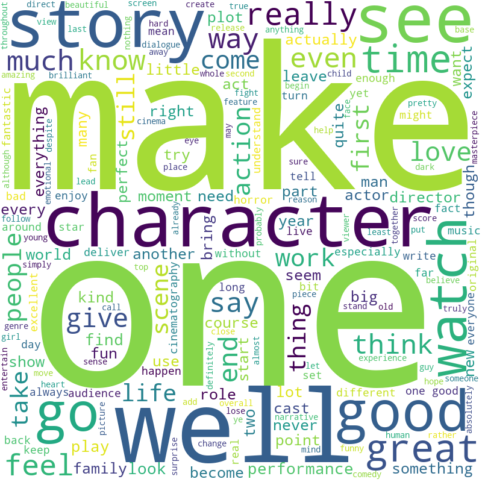
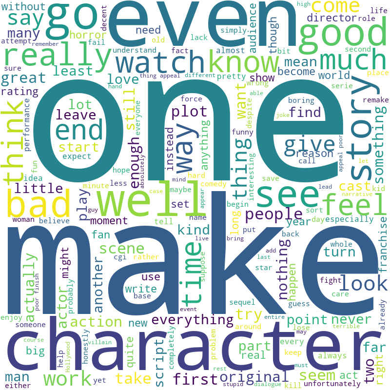
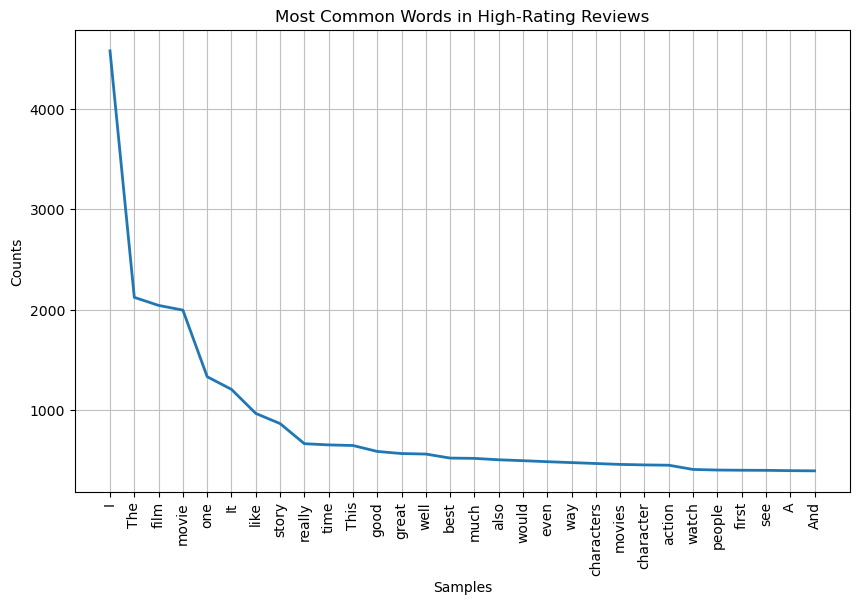
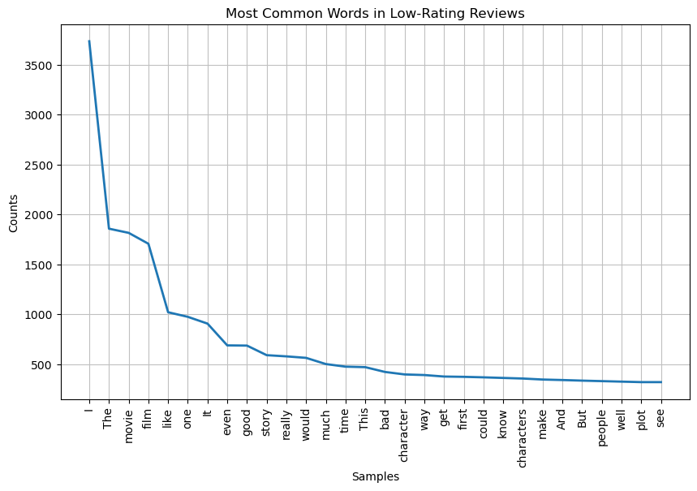

# data-enrichment-project
 
## NLP Analysis of Movie Reviews
Reviews were rated on a scale of 1-10 (1 being low and 10 being high). I grouped them into high and low reviews. With high being a 9 or 10 rated review, and low being a review less than or equal to 4. All other reviews were omitted for this analysis.

Source: https://developer.themoviedb.org/docs
License: 

### Word Cloud Comparison 

### Frequency Distribution

### N-Grams
|    | Words                     |     Pmi |\n|---:|:--------------------------|--------:|\n|  0 | ('Annette', 'Bening')     | 15.7483 |\n|  1 | ('Banshees', 'Inisherin') | 15.7483 |\n|  2 | ('Bone', 'Tomahawk')      | 15.7483 |\n|  3 | ('Corto', 'Maltese')      | 15.7483 |\n|  4 | ('Hansel', 'Gretel')      | 15.7483 |\n|  5 | ('Hildur', 'Guðnadóttir') | 15.7483 |\n|  6 | ('Ice', 'Cube')           | 15.7483 |\n|  7 | ('Imogen', 'Poots')       | 15.7483 |\n|  8 | ('Jaeden', 'Martell')     | 15.7483 |\n|  9 | ('Kemp', 'Powers')        | 15.7483 |

|    | Words                    |    Pmi |\n|---:|:-------------------------|-------:|\n|  0 | ('Bohemian', 'Rhapsody') | 15.468 |\n|  1 | ('Djimon', 'Hounsou')    | 15.468 |\n|  2 | ('Jared', 'Leto')        | 15.468 |\n|  3 | ('Juliette', 'Danielle') | 15.468 |\n|  4 | ('Lethal', 'Weapon')     | 15.468 |\n|  5 | ('Lorne', 'Balfe')       | 15.468 |\n|  6 | ('Rice', 'Burroughs')    | 15.468 |\n|  7 | ('Solar', 'Opposites')   | 15.468 |\n|  8 | ('Taraji', 'Henson')     | 15.468 |\n|  9 | ('n', 'ga')              | 15.468 |

